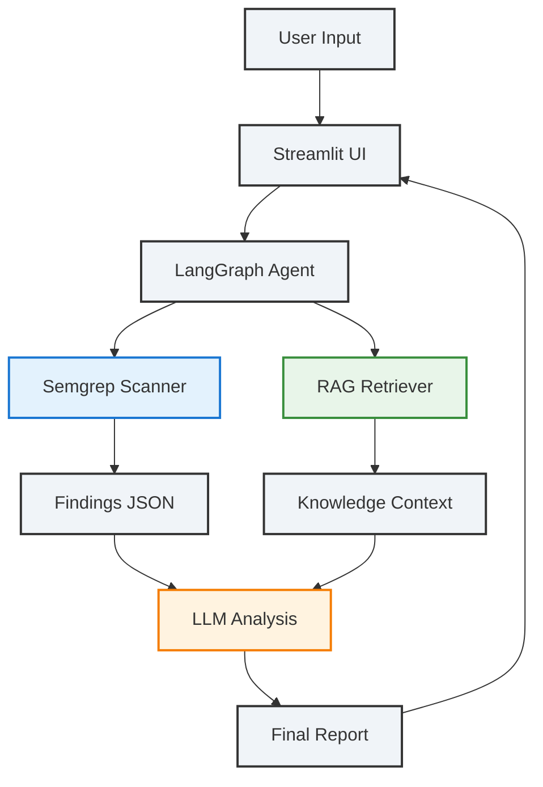

# Local AI Bug Hunter 🔒

**A fully local, privacy-first AI-powered vulnerability scanner**

Local AI Bug Hunter is a hybrid **agentic RAG security analysis system** that combines deterministic static analysis with grounded LLM reasoning to produce **accurate, explainable, and actionable vulnerability reports** — all while keeping your code **100% offline**.

---

## ✨ Key Highlights

- 🔐 **Fully Local & Private** — No cloud calls. No data leakage.
- 🧠 **Hybrid Intelligence** — Semgrep for rule-based scanning + LLM reasoning for context and fixes.
- 📚 **Grounded AI (RAG)** — Uses a local knowledge base (OWASP, CWE, CVE patterns) to reduce hallucinations.
- 🔁 **Agentic Workflow** — LangGraph-powered stateful agent with conditional refinement loops.
- 🖥️ **Simple Web UI** — Streamlit interface for fast scans via paste or upload.
- 🧩 **Highly Extensible** — Add scanners, models, rules, or knowledge sources with ease.

---

## 🧠 Models Used (Local, January 2026)

| Purpose | Model |
|------|------|
| LLM Reasoning | `deepseek-r1:8b ` |
| Embeddings | `nomic-embed-text:latest` |

---

## 🏗️ System Architecture

### High-Level Flow

```
User
 ↓
Streamlit UI (app.py)
 ↓
LangGraph Agent (graph/agent_graph.py)
 ├─ Semgrep Scanner
 ├─ RAG Retriever (Chroma)
 └─ LLM Reasoning Node
 ↓
Final Markdown Security Report
```

---

## 🔄 Data Flow Diagram



---

## 🧩 Core Components

| Component | Technology | Role |
|--------|-----------|------|
| UI | Streamlit | Code input & report display |
| Agent Orchestration | LangGraph | Stateful, conditional workflow |
| Static Analysis | Semgrep | Fast, reliable vulnerability detection |
| Retrieval (RAG) | Chroma + Ollama | Grounding LLM outputs |
| LLM | deepseek-r1:8b  | Deep reasoning & remediation |
| Knowledge Base | Local docs | OWASP, CWE, CVE references |

---

## 📦 Quick Start

### Prerequisites

- Python **3.10+**
- **Ollama** installed and running
- Semgrep installed

---

### 1️⃣ Pull Required Models

```bash
ollama pull deepseek-r1:8b 
ollama pull nomic-embed-text:latest
```

---

### 2️⃣ Install Dependencies

```bash
pip install -r requirements.txt
```

---

### 3️⃣ Build the RAG Knowledge Base

Place reference documents in:

```
rag/data/sources/
```

Then ingest:

```bash
python rag/ingestor.py
```

---

### 4️⃣ Run the App

```bash
streamlit run app.py
```

---

## ⚙️ Configuration

Edit `config.yaml` to customize:

- Model tags
- Retrieval parameters
- Agent loop limits

---

## 🤝 Contributing

Contributions are welcome via issues and pull requests.

---

## ⚠️ Ethical Use Disclaimer

This tool is intended **only for authorized testing**.

---

## 📄 License

MIT License

---

Built with ❤️ in January 2026